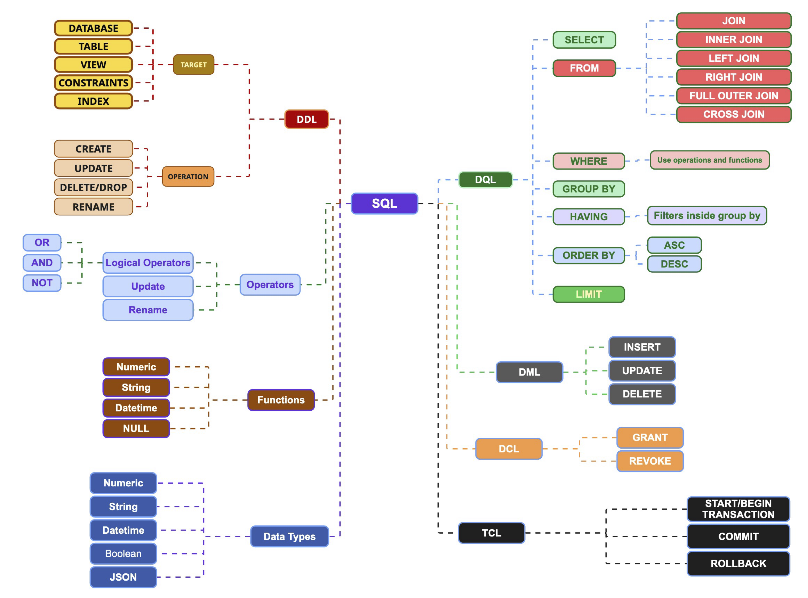

# Week 2 - Working with Multiple Tables



## Initial Instructions

Welcome to the second week of the course! This week, we will focus on working with multiple tables in SQL. We will learn how to join tables, use subqueries, and perform advanced data retrieval operations.

This week is crucial for understanding how to work with relational databases, as most real-world applications involve multiple tables that need to be queried together. By the end of this week, you should be comfortable writing complex SQL queries that involve multiple tables and understand how to design your database schema to support these operations.


## Week 2 SLOs

- Understand set operations and how to use them in SQL.
- Learn how to use `UNION`, `INTERSECT`, and `EXCEPT` to combine results from multiple queries.
- Learn and use `JOIN` operations to retrieve data from multiple tables.
- Understand the differences between `INNER JOIN`, `LEFT JOIN`, `RIGHT JOIN`, `FULL OUTER JOIN` and `CROSS JOIN`.
- Use subqueries to create more complex queries.
- Learn and use aggregate functions to summarize data such as `SUM()`, `AVG()`, `COUNT()`, `MIN()`, `MAX()`, etc.
- Use `GROUP BY` and `HAVING` clauses to filter aggregated data.
- Understand the difference between `WHERE` and `HAVING` clauses.


## Week 2 Assignments

This week requires you to complete the following tasks:

1. **Read** the following material available in the Hekman Library system: *Mark Simon. (2023). Getting Started with SQL and Databases : Managing and Manipulating Data with SQL. Apress. - Chapters 4, 5 and 6*
2. Complete **Homework 2**.
3. Complete **Project 2**.
4. Show up for **classes** on MWF from 2.45 PM to 3.50 PM.

## Week 2 Overview

This week, we will cover the topics shown below. This is a shortcut in case you want to go back to a specific topic.

```{tableofcontents}
```